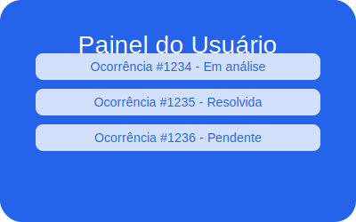
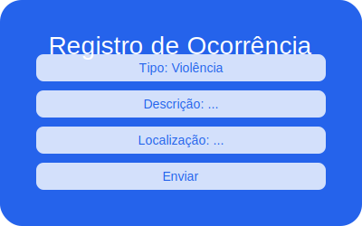

## Instalação como PWA (Progressive Web App)

O SafeBridge pode ser instalado como aplicativo no seu dispositivo:

1. Abra o site no navegador (Chrome, Edge, Safari, Android ou iOS).
2. Procure o ícone de instalação na barra de endereço ou no menu do navegador ("Instalar app" ou "Adicionar à tela inicial").
3. Confirme a instalação. O app funcionará offline e terá acesso rápido pelo seu dispositivo.

**Funcionalidades PWA:**
- Instalação como app nativo
- Funcionamento offline
- Atualização automática

Se não aparecer a opção, limpe o cache do navegador e recarregue o site.

## Prints do Site




## Prints do Site


# SafeBridge

<!-- Diagrama de Arquitetura -->
<p align="center">
	
</p>

**Arquitetura Resumida:**

- **Frontend:** Next.js (React, App Router, TailwindCSS)
- **Backend:** Next.js API Routes, Prisma ORM
- **Banco de Dados:** SQLite (dev) / Postgres/Supabase (prod)
- **Storage:** Supabase Storage ou S3 para anexos
- **Autenticação:** NextAuth.js
- **CI/CD:** Vercel, GitHub Actions
- **Monitoramento:** Sentry, Vercel Analytics

Fluxo:
Usuário → Frontend (Next.js) → API Routes → Prisma → Banco/Storage → Dashboard/Admin

<!-- Fluxograma de fluxo principal -->
<p align="center">
	
</p>


<!-- Badges CI/CD -->
<p align="left">
	<a href="https://github.com/MarcioGil/SafeBridge/actions/workflows/ci.yml">
		
	</a>
	<a href="https://vercel.com/dashboard">
		
	</a>
	<a href="https://github.com/MarcioGil/SafeBridge">
		
	</a>
</p>

<!-- Demo do site -->
<p align="center">
  <a href="https://safebridge-clean-oy6v9r5r6-marciogils-projects.vercel.app" target="_blank">
    
  </a>
</p>


## 🚀 Quick Start
Clone, instale as dependências, configure o ambiente e rode localmente:

```bash
git clone https://github.com/MarcioGil/SafeBridge.git
cd SafeBridge
npm install
cp .env.example .env # configure as variáveis
npm run dev
```

### 🖥️ Como entrar localmente no app

1. Inicie o servidor local:
	```bash
	npm run dev
	```
2. Acesse no navegador: [http://localhost:3000](http://localhost:3000)

<p align="center">
	<a href="http://localhost:3000" target="_blank" style="font-size:1.2em;font-weight:bold;">Abrir o app localmente</a>
</p>
3. Use as rotas principais:
	- `/` (Home)
	- `/dashboard` (Dashboard)
	- `/occurrence` (Registrar Ocorrência)
	- `/privacy` (Privacidade)
	- `/auth/signin` (Login)


### 🌱 Variáveis de Ambiente (.env)

Crie um arquivo `.env` baseado em `.env.example` e preencha conforme seu ambiente:

```env
DATABASE_URL="file:./dev.db" # Para dev local
NEXTAUTH_SECRET="sua-chave-secreta"
NEXTAUTH_URL="http://localhost:3000" # Ou URL de produção
SUPABASE_URL="https://xxxx.supabase.co" # Se usar Supabase
SUPABASE_KEY="chave-api-supabase"
UPLOAD_BUCKET="provas"
```

> Gere o NEXTAUTH_SECRET com: `node -e "console.log(require('crypto').randomBytes(64).toString('hex'))"`

Consulte `.env.example` para mais detalhes e exemplos.

### 🗄️ Backup e Restauração do Banco (SQLite)

**Backup:**
O script `scripts/backup-db.sh` salva uma cópia do banco local (`dev.db`) na pasta `backups/`.

```bash
sh scripts/backup-db.sh
```
O backup será salvo em `backups/dev-AAAAmmdd-HHMMSS.db`.

**Restauração:**
Para restaurar o banco a partir de um backup:

```bash
sh scripts/restore-db.sh backups/dev-AAAAmmdd-HHMMSS.db
```
Isso irá substituir o arquivo `dev.db` pelo backup selecionado.

> **Importante:** Sempre pare o servidor antes de restaurar o banco para evitar corrupção de dados.

### 📦 Outras dicas para uso local
- Para rodar testes: `npx vitest run`
- Para rodar testes E2E: `npx playwright test`
- Para rodar lint: `npm run lint`
- Para rodar build de produção: `npm run build`

Consulte também o arquivo `docs/backup-recovery.md` para detalhes avançados de backup e recuperação.

### 🚦 Deploy Preview e Dependabot

- O projeto já possui configuração de **Dependabot** (`.github/dependabot.yml`) para atualização automática de dependências npm e GitHub Actions.
- Deploy preview pode ser ativado conectando o repositório à Vercel e habilitando Preview Deploys no painel.
- Workflows de CI/CD e qualidade estão em `.github/workflows/`.

> Recomenda-se revisar periodicamente as PRs abertas pelo Dependabot e testar o deploy preview antes de aprovar mudanças.


<!-- Prints do app -->
<p align="center">
	
	
</p>


# SafeBridge

## Finalidade do Projeto
SafeBridge é uma plataforma digital desenvolvida para facilitar o registro, acompanhamento e gestão de ocorrências relacionadas à segurança e proteção de pessoas em ambientes urbanos e institucionais. O objetivo é oferecer um canal seguro, acessível e confiável para que qualquer pessoa possa relatar situações de risco, promover a transparência e fortalecer a resposta a incidentes.

## Público-Alvo
O aplicativo é destinado a:
- Cidadãos em geral que desejam relatar ocorrências de forma anônima ou identificada
- Profissionais de segurança, gestores públicos e equipes de resposta a emergências
- Pessoas com deficiência (PCDs), garantindo total acessibilidade digital
- Organizações e instituições que buscam monitorar e responder a incidentes de forma eficiente

## Acessibilidade
O SafeBridge foi projetado para ser totalmente acessível, permitindo que pessoas com deficiência (PCDs) utilizem o aplicativo com autonomia e segurança. As principais práticas e ferramentas adotadas incluem:

- **WCAG 2.1 AA**: Todos os fluxos seguem as Diretrizes de Acessibilidade para Conteúdo Web, garantindo contraste adequado, navegação por teclado, foco visível e ausência de barreiras para usuários com deficiência visual, auditiva, motora ou cognitiva.
- **HTML Semântico e ARIA**: Uso correto de headings, landmarks, roles e atributos ARIA para facilitar a navegação por leitores de tela (NVDA, JAWS, VoiceOver).
- **Labels e Descrições**: Todos os campos de formulário possuem labels associadas e descrições claras, inclusive para botões e áreas interativas.
- **Imagens com Texto Alternativo**: Todas as imagens e ícones possuem atributos `alt` descritivos, essenciais para usuários de leitores de tela.
- **Responsividade**: Layout adaptado para desktop, tablet e mobile, com elementos grandes e espaçamento adequado para navegação por toque.
- **Foco Visível e Navegação por Tabulação**: Todos os elementos interativos são acessíveis via teclado, com destaque visual de foco.
- **Testes com Ferramentas de Acessibilidade**: Utilização de Lighthouse, axe-core, Wave e testes manuais com leitores de tela para validação contínua.
- **Documentação e Feedback**: Orientações para uso acessível e canal para feedback de PCDs, promovendo melhoria contínua.

Essas práticas garantem que o SafeBridge seja inclusivo e possa ser utilizado por todos, sem exceção.

# Vozes Seguras

Projeto fullstack Next.js + TypeScript + Prisma + SQLite (dev) / Postgres (prod).

## Checklist de Produção

- Teste todas as rotas: `/`, `/dashboard`, `/occurrence`, `/privacy`
- Valide login, registro, upload e dashboard
- Verifique acessibilidade e responsividade
- Garanta backup do banco: `vozesseguras/dev.db`

## Segurança

- NEXTAUTH_SECRET gerado forte no `.env`
- Para produção, configure HTTPS e CSP seguro
- Nunca exponha dados sensíveis em variáveis públicas


## Deploy na Vercel (Recomendado)

1. Crie uma conta em [vercel.com](https://vercel.com) e conecte seu repositório (GitHub/GitLab/Bitbucket).

2. Configure as variáveis de ambiente no painel da Vercel:

	```env
	DATABASE_URL=postgresql://...         # URL do banco (Supabase/PostgreSQL)
	NEXTAUTH_SECRET=...                   # Chave forte (gere com: node -e "console.log(require('crypto').randomBytes(64).toString('hex'))")
	NEXTAUTH_URL=https://seuprojeto.vercel.app
	STORAGE_URL=...                       # (opcional, se usar Supabase Storage/S3)
	STORAGE_KEY=...                       # (opcional, se usar Supabase Storage/S3)
	```

3. No painel da Vercel, defina:
	- Framework: Next.js
	- Build Command: `npm run build`
	- Output Directory: `.`
	- Install Command: `npm install`

4. Banco de dados:
	- Use Supabase ou PostgreSQL gerenciado (crie o banco e cole a URL em `DATABASE_URL`)
	- Rode as migrações pelo terminal local:

	  ```bash
	  npx prisma migrate deploy --schema=prisma/schema.prisma
	  ```

5. Storage (uploads):
	- Configure Supabase Storage ou S3 e preencha as variáveis no painel da Vercel

6. Deploy:
	- Clique em "Deploy" na Vercel. O build será feito automaticamente.
	- Após o deploy, acesse a URL gerada e teste todos os fluxos.

7. Dicas finais:
	- Nunca suba o arquivo `.env` para o repositório
	- Sempre teste login, upload, dashboard e acessibilidade após deploy
	- Consulte os logs da Vercel para eventuais erros
	- Para automatizar o envio do código ao GitHub antes do deploy, use:

	  ```bash
	  npm run deploy:push
	  ```

---

## Comandos úteis

- Instalar dependências: `npm install`
- Build: `npm run build`
- Start produção: `npm start`
- Dev: `npm run dev`
- Migração Prisma: `npx prisma migrate dev --schema=prisma/schema.prisma`
- Gerar client Prisma: `npx prisma generate --schema=prisma/schema.prisma`


## Fluxo de uso (resumido)

1. Usuário acessa o app e navega pelas rotas principais
2. Registra ocorrência via formulário
3. Faz upload de provas (opcional)
4. Consulta status no dashboard
5. Admin/ONG pode acessar painel para triagem

## Exemplo de uso da API

### Registrar ocorrência
```http
POST /api/occurrences
Content-Type: application/json

{
	"type": "Violência",
	"description": "Descrição detalhada do caso",
	"city": "São Paulo",
	"latitude": -23.5,
	"longitude": -46.6,
	"proofs": ["https://storage.com/file.jpg"],
	"consent": true,
	"anonymous": false
}
```

### Upload de provas
```http
POST /api/occurrences/upload
Content-Type: application/json

{
	"filename": "foto.jpg",
	"mimetype": "image/jpeg",
	"size": 123456
}
```

### Encaminhar ocorrência
```http
POST /api/occurrences/forward
Content-Type: application/json

{
	"occurrenceId": "ck123...",
	"email": "destinatario@exemplo.com"
}
```

## Estrutura
...existing code...

## Comandos iniciais

```bash
npm install prisma @prisma/client next-auth tailwindcss postcss autoprefixer zod
npx prisma init
npx tailwindcss init -p
```

## Migração inicial

```bash
npx prisma migrate dev --name init
npx prisma generate
```

## Estrutura de pastas

- /app
- /components
- /lib
- /prisma
- /public

## Segurança
- HTTPS obrigatório em produção
- CSP, rate limiting, CORS, uploads seguros
- Secrets em vault/env vars
- Backups automáticos
- Logs mascarados
- Testes automatizados
- Testes de acessibilidade
- Política de privacidade
- Plano de resposta a incidentes

## Acessibilidade
- WCAG 2.1 AA
- HTML semântico
- Foco visível
- Contraste adequado
- Labels associadas
- Imagens com alt
- Layout responsivo

## Observações
- SQLite apenas para desenvolvimento
- Postgres/Supabase em produção
- Storage: S3/Supabase

---
