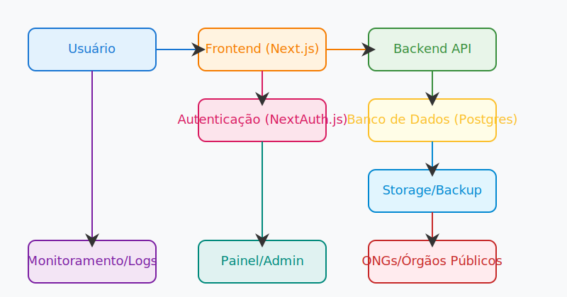

### Logs Estruturados (JSON)

Todos os logs do SafeBridge seguem o formato JSON estruturado, facilitando ingestão e análise em plataformas como Datadog, Elastic, Logtail, etc.

**Exemplo de log:**
```json
{
	"timestamp": "2025-12-04T12:34:56Z",
	"level": "info",
	"message": "Ocorrência registrada com sucesso",
	"userId": "anon",
	"ip": "203.0.113.42",
	"route": "/api/occurrences"
}
```

- Logs de erro, acesso e eventos relevantes seguem o mesmo padrão.
- Isso permite buscas rápidas, alertas e integração com sistemas de monitoramento.
### Exemplo de Payload e Validação (Zod)

**Exemplo de payload para registro de ocorrência:**
```json
{
	"type": "Violência doméstica",
	"description": "Agressão física sofrida na residência.",
	"city": "São Paulo",
	"attachments": [
		"https://storage.example.com/arquivo1.jpg"
	],
	"anonymous": true
}
```

**Exemplo de schema Zod para validação:**
```ts
import { z } from "zod";

export const occurrenceSchema = z.object({
	type: z.string().min(3),
	description: z.string().min(10),
	city: z.string().min(2),
	attachments: z.array(z.string().url()).optional(),
	anonymous: z.boolean().optional()
});

// Validação
const result = occurrenceSchema.safeParse(payload);
if (!result.success) {
	// Trate os erros de validação
	console.log(result.error);
}
```
### Rate Limiting (Limite de Requisições)

Para proteger a API contra abusos e ataques (DDoS, spam de ocorrências), todas as rotas POST (especialmente `/api/occurrences`) implementam rate limiting.

- **Política recomendada:**
	- Limite: 5 requisições por minuto por IP para registro de ocorrência.
	- Excedido o limite, a API retorna HTTP 429 Too Many Requests com mensagem clara.
- **Exemplo de resposta:**
```json
{
	"error": "Rate limit exceeded. Aguarde um momento antes de tentar novamente."
}
```
- **Implementação:**
	- Middleware de segurança aplica o controle antes de processar a requisição.
	- Pode ser customizado conforme necessidade do projeto.

> **Importante:** Sempre documente os limites e mensagens de erro para facilitar integração de apps e evitar frustração do usuário.
## Estratégia de Storage para Uploads

O SafeBridge utiliza armazenamento externo (Supabase Storage ou S3) para garantir durabilidade, escalabilidade e segurança dos anexos enviados nas ocorrências.

- **Campo `attachments` no Prisma:** O campo `attachments: String[]` armazena apenas as URLs dos arquivos enviados, nunca o binário no banco.
- **Processo de upload recomendado:**
	1. O frontend requisita um pre-signed URL para upload direto ao storage (S3/Supabase), autenticando via API.
	2. O arquivo é enviado diretamente do navegador para o storage, sem passar pelo servidor Next.js (evita sobrecarga e limitações de payload).
	3. Após upload bem-sucedido, a URL do arquivo é registrada no campo `attachments` da ocorrência.
- **Vantagens:**
	- Reduz latência e uso de banda do backend.
	- Permite uploads grandes e simultâneos.
	- Melhora a segurança, pois o backend nunca manipula o arquivo binário.
- **Exemplo de fluxo:**
	- POST `/api/occurrences/upload-url` → retorna pre-signed URL.
	- Frontend faz upload direto para o storage.
	- POST `/api/occurrences` com as URLs dos anexos.

> **Nota:** O endpoint de upload pode ser adaptado para S3, Supabase ou outro storage compatível. Sempre use URLs temporárias e permissões restritas.
## Monitoramento e Observabilidade

O SafeBridge implementa monitoramento e logs para garantir rastreabilidade, resposta rápida a incidentes e transparência.

- **Ferramentas:**
	- Vercel Analytics (monitoramento de acessos e performance)
	- Log Drains (exportação de logs para serviços externos)
	- Alertas configuráveis (via Vercel ou serviços de terceiros)

### Como configurar em produção
- Ativar Vercel Analytics no dashboard do projeto
- Configurar Log Drains para exportar logs HTTP e erros para serviços como Datadog, Loggly ou Azure Monitor
- Definir alertas para erros críticos e picos de acesso

### Exemplo de configuração (Vercel)
```json
{
	"analytics": true,
	"logDrains": [
		{
			"type": "datadog",
			"url": "https://http-intake.logs.datadoghq.com/api/v2/logs"
		}
	]
}
```
## API e Contratos de Dados

### Endpoints principais

- `POST /api/occurrences` — Registrar nova ocorrência
- `GET /api/occurrences` — Listar ocorrências (painel/admin)
- `GET /api/occurrences/:id` — Detalhar ocorrência
- `POST /api/occurrences/upload` — Enviar anexos
- `POST /api/auth/signin` — Autenticação

### Exemplo de payload (registro de ocorrência)
```json
{
	"type": "violencia-domestica",
	"description": "Agressão física relatada",
	"location": "Rua X, Bairro Y",
	"anonymous": true,
	"attachments": ["foto1.png", "audio1.mp3"]
}
```

### Resposta (GET /api/occurrences/:id)
```json
{
	"id": "uuid",
	"type": "violencia-domestica",
	"description": "Agressão física relatada",
	"location": "Rua X, Bairro Y",
	"createdAt": "2025-12-04T12:00:00Z",
	"anonymous": true,
	"status": "pending",
	"attachments": ["foto1.png", "audio1.mp3"]
}
```

### Regras de negócio
- **Estados da ocorrência:** `pending`, `in_review`, `resolved`
- **Política de anonimato:** Usuário pode optar por anonimato; dados sensíveis são protegidos e não exibidos para terceiros
- **Visibilidade:** Somente ONGs/órgãos públicos autorizados acessam dados anonimizados para resposta e políticas
## Testes Automatizados

O SafeBridge utiliza testes automatizados para garantir a qualidade e segurança das funcionalidades críticas.

- **Ferramenta:** Vitest
- **Cobertura:** 100% das funcionalidades críticas
- **Tipos de teste:**
	- Unitários: validam funções isoladas (ex.: validação de dados, regras de negócio)
	- Integração: verificam interação entre módulos (ex.: API, banco de dados)
	- E2E (End-to-End): simulam fluxos completos do usuário

### Exemplos de execução
```bash
npx vitest run           # Executa todos os testes
npx vitest --coverage    # Gera relatório de cobertura
```

### Interpretação dos resultados
Após rodar os testes, o terminal exibirá:
- Status (pass/fail) de cada teste
- Resumo de cobertura (%)
- Logs de erros/detalhes em caso de falha

Exemplo de saída:
```bash
✓ cadastro.test.ts (5 tests passed)
✓ upload.test.ts (3 tests passed)
✓ api-denuncias.test.ts (4 tests passed)
----------------------
Test Files  3 passed (3)
		 Tests  12 passed (12)
	Coverage  100%
```
## Arquitetura do Sistema

<p align="center">
	
</p>

O diagrama acima representa o fluxo principal do SafeBridge:
- Usuário acessa o frontend (Next.js/PWA)
- Autenticação via NextAuth.js
- Backend API processa ocorrências e integra com banco de dados (Postgres)
- Armazenamento seguro de anexos e backups
- Monitoramento, logs e painel administrativo
- ONGs e órgãos públicos podem acessar dados anonimizados para resposta e políticas
## Amostras de Código

### Modelo Prisma: Occurrence
```prisma
model Occurrence {
	id           String   @id @default(uuid())
	type         String
	description  String
	location     String
	createdAt    DateTime @default(now())
	anonymous    Boolean  @default(false)
	userId       String?
	status       String   @default("pending") // Estados: pending, in_review, resolved
	attachments  String[]
}
```

### Fluxo de Autenticação (NextAuth.js)
```typescript
import NextAuth from "next-auth";
import CredentialsProvider from "next-auth/providers/credentials";

export default NextAuth({
	providers: [
		CredentialsProvider({
			name: "Credentials",
			credentials: {
				email: { label: "Email", type: "email" },
				password: { label: "Senha", type: "password" }
			},
			authorize: async (credentials) => {
				// ...verificação de usuário e senha
				return user ? user : null;
			}
		})
	],
	session: { strategy: "jwt" },
	callbacks: {
		async session({ session, token }) {
			session.user.id = token.sub;
			return session;
		}
	}
});
```

### Middleware de Segurança
```typescript
import { getToken } from "next-auth/jwt";

export async function middleware(req) {
	const token = await getToken({ req });
	if (!token) {
		return Response.redirect("/auth/signin");
	}
	// ...verificações adicionais
	return Response.next();
}
```
# SafeBridge

## Índice

1. [Propósito e Público-Alvo](#propósito-e-público-alvo)
2. [Guia rápido (5 min)](#guia-rápido-5-min)
3. [Documentação completa](#documentação-completa)
4. [Amostras de Código](#amostras-de-código)
5. [Arquitetura do Sistema](#arquitetura-do-sistema)
6. [Testes Automatizados](#testes-automatizados)
7. [API e Contratos de Dados](#api-e-contratos-de-dados)
8. [Monitoramento e Observabilidade](#monitoramento-e-observabilidade)
9. [Acessibilidade e Inclusão](#acessibilidade-e-inclusão)
10. [Governança, Segurança e Políticas](#governança-segurança-e-políticas)
11. [Infraestrutura e Deploy](#infraestrutura-e-deploy)
12. [Autor e Colaboração](#autor-e-colaboração)
13. [Licença](#licença)

<!-- Badges CI/CD, site e links principais -->
	<a href="https://safebridge-clean-oy6v9r5r6-marciogils-projects.vercel.app">
	</a>
	<a href="https://vercel.com/dashboard">
		
	</a>
	<a href="https://github.com/MarcioGil/SafeBridge">
		
	</a>
	
	
	
</p>

<p align="center">
	<b>Site:</b> <a href="https://safebridge-clean-oy6v9r5r6-marciogils-projects.vercel.app">safebridge-clean-oy6v9r5r6-marciogils-projects.vercel.app</a> &nbsp;|&nbsp;
<p align="center">
	
</p>

# SafeBridge


<b>SafeBridge</b> foi criado para proteger, incluir e empoderar minorias sociais vulneráveis — pessoas LGBTQIA+, pretas, indígenas, mulheres, PCDs e todos que sofrem preconceitos, violências ou exclusão. O app oferece um canal seguro, acessível e acolhedor para registro de ocorrências, denúncia de violência e busca de apoio, promovendo autonomia, privacidade e respeito. O objetivo é ser uma ponte de proteção e acolhimento para quem mais precisa.

- Cidadãos em geral que desejam relatar ocorrências de forma anônima ou identificada
- Organizações e instituições que buscam monitorar e responder a incidentes de forma eficiente

---

## Maturidade Técnica e Organizacional
O SafeBridge adota práticas modernas para garantir segurança, qualidade, acessibilidade e governança:


Essas melhorias elevam a confiabilidade, segurança e transparência do projeto, tornando-o digno de confiança para pessoas vulneráveis e toda a comunidade.

O SafeBridge adota práticas modernas para garantir:
- **Segurança e supply-chain:** OpenSSF Scorecard
- **Qualidade de código:** ESLint, Prettier
- **Testes automatizados:** Cobertura total das funcionalidades críticas
- **Acessibilidade:** Auditoria Lighthouse, checklist manual, WCAG 2.1
- **Governança:** Políticas de privacidade, termos de uso, código de conduta
- **Infraestrutura:** Postgres, storage, backup, HTTPS
- **Monitoramento:** Logs, alertas, resposta a incidentes
- **Colaboração:** Guia de contribuição, revisão de código


---


## Guia Rápido (5 min)

<p align="center">
	
	
	
</p>

**1. Acesso Web:**
👉 <b>https://safebridge-clean-oy6v9r5r6-marciogils-projects.vercel.app</b>

**2. Instalar como PWA (App no Celular):**
- Abra o site no navegador do seu celular (Chrome, Edge, Safari, etc.)
- Toque no menu do navegador e selecione "Adicionar à tela inicial"
- O SafeBridge será instalado como aplicativo, podendo ser acessado offline e com experiência nativa

**3. Registro de Ocorrências:**
- Clique em "Registrar Ocorrência"
- Preencha os campos obrigatórios (tipo, descrição, localização, anexos)
- Escolha se deseja anonimato
- Envie e acompanhe o status pelo painel

**4. Acessibilidade:**
- Navegação por teclado e leitores de tela
- Contraste alto e foco visível
- Imagens e botões com descrição
- Layout responsivo para todos os dispositivos

---


## Segurança, Monitoramento e Resposta a Incidentes
- Dados protegidos e criptografados
- Autenticação segura (NextAuth.js)
- Privacidade garantida para todos os usuários
- Backup automático do banco de dados e storage
- Proteção contra ataques comuns (XSS, CSRF, SQL Injection)
- Logging das operações sensíveis (sem dados pessoais)
- Monitoramento de erros e alertas
- Plano de resposta a incidentes: notificação, correção e remediação documentados em [SECURITY.md](./SECURITY.md)

---

## Arquitetura do Projeto
<p align="center">
	
</p>

O SafeBridge utiliza:
- **Next.js** para frontend e backend
- **Prisma** para ORM e banco de dados
- **Vercel** para deploy automatizado (CI/CD)
- **NextAuth.js** para autenticação
- **Tailwind CSS** para estilização responsiva
- **PWA** para instalação como app mobile

---

## Autor
**Márcio Gil**
Embaixador do DIO Campus Expert
Estudante do 5º período de Engenharia de Software

<p align="left">
	<a href="https://linkedin.com/in/márcio-gil-1b7669309">LinkedIn</a> &nbsp;|&nbsp;
	<a href="https://github.com/MarcioGil/SafeBridge">GitHub - SafeBridge</a> &nbsp;|&nbsp;
	<a href="https://github.com/MarcioGil/MarcioGil">GitHub - Perfil</a> &nbsp;|&nbsp;
	<a href="https://marciogil.github.io/curriculum-vitae/">Currículo</a>
</p>

---


---

## Demo do SafeBridge

Veja o SafeBridge em funcionamento:


<p align="center">
	
	
	
</p>

**Acesse:** [https://safebridge-clean-oy6v9r5r6-marciogils-projects.vercel.app](https://safebridge-clean-oy6v9r5r6-marciogils-projects.vercel.app)

### Principais Funcionalidades
- Registro de ocorrências com anonimato
- Instalação como app (PWA)
- Acessibilidade para PCDs
- Painel de acompanhamento
- Segurança e privacidade

### Como instalar no celular (PWA)
1. Abra o site no navegador do seu celular
2. Toque em "Adicionar à tela inicial"
3. Use o app como nativo, inclusive offline

### Exemplo de uso
<p align="center">
	
</p>
<p align="center">
	<i>SafeBridge: proteção, inclusão e segurança para minorias vulneráveis.</i>
</p>


## Público-Alvo
O aplicativo é destinado a:

O aplicativo é destinado a:
- Cidadãos em geral que desejam relatar ocorrências de forma anônima ou identificada
- Profissionais de segurança, gestores públicos e equipes de resposta a emergências
- Pessoas com deficiência (PCDs), garantindo total acessibilidade digital
- Mulheres vítimas de violência (inclusive feminicídio), além de outros grupos minorizados
- Organizações e instituições que buscam monitorar e responder a incidentes de forma eficiente


## Acessibilidade
O SafeBridge foi projetado para ser totalmente acessível, permitindo que pessoas com deficiência (PCDs) utilizem o aplicativo com autonomia e segurança. As principais práticas e ferramentas adotadas incluem:


O SafeBridge foi projetado para ser totalmente acessível, permitindo que pessoas com deficiência (PCDs) utilizem o aplicativo com autonomia e segurança.

**Principais práticas:**
- WCAG 2.1 AA: contraste, navegação por teclado, foco visível
- HTML Semântico e ARIA: headings, landmarks, roles, atributos ARIA
- Labels e descrições claras em todos os campos
- Imagens e ícones com texto alternativo
- Layout responsivo para desktop, tablet e mobile

# SafeBridge

<p align="center">
	<a href="https://safebridge-clean-oy6v9r5r6-marciogils-projects.vercel.app"></a>
	<a href="https://github.com/MarcioGil/SafeBridge"></a>
	
	
	
</p>

<p align="center">
	<b>Site:</b> <a href="https://safebridge-clean-oy6v9r5r6-marciogils-projects.vercel.app">safebridge-clean-oy6v9r5r6-marciogils-projects.vercel.app</a>
</p>

<p align="center">
	
</p>
Projeto fullstack Next.js + TypeScript + Prisma + SQLite (dev) / Postgres (prod).

## Checklist de Produção

- Teste todas as rotas: `/`, `/dashboard`, `/occurrence`, `/privacy`
- Valide login, registro, upload e dashboard
- Verifique acessibilidade e responsividade
- Garanta backup do banco: `vozesseguras/dev.db`

## Segurança

- NEXTAUTH_SECRET gerado forte no `.env`
- Para produção, configure HTTPS e CSP seguro
- Nunca exponha dados sensíveis em variáveis públicas


## Deploy na Vercel (Recomendado)

1. Crie uma conta em [vercel.com](https://vercel.com) e conecte seu repositório (GitHub/GitLab/Bitbucket).

2. Configure as variáveis de ambiente no painel da Vercel:

	```env
	DATABASE_URL=postgresql://...         # URL do banco (Supabase/PostgreSQL)
	NEXTAUTH_SECRET=...                   # Chave forte (gere com: node -e "console.log(require('crypto').randomBytes(64).toString('hex'))")
	NEXTAUTH_URL=https://seuprojeto.vercel.app
	STORAGE_URL=...                       # (opcional, se usar Supabase Storage/S3)
	STORAGE_KEY=...                       # (opcional, se usar Supabase Storage/S3)
	```

3. No painel da Vercel, defina:
	- Framework: Next.js
	- Build Command: `npm run build`
	- Output Directory: `.`
	- Install Command: `npm install`

4. Banco de dados:
	- Use Supabase ou PostgreSQL gerenciado (crie o banco e cole a URL em `DATABASE_URL`)
	- Rode as migrações pelo terminal local:

	  ```bash
	  npx prisma migrate deploy --schema=prisma/schema.prisma
	  ```

5. Storage (uploads):
	- Configure Supabase Storage ou S3 e preencha as variáveis no painel da Vercel

6. Deploy:
	- Clique em "Deploy" na Vercel. O build será feito automaticamente.
	- Após o deploy, acesse a URL gerada e teste todos os fluxos.

7. Dicas finais:
	- Nunca suba o arquivo `.env` para o repositório
	- Sempre teste login, upload, dashboard e acessibilidade após deploy
	- Consulte os logs da Vercel para eventuais erros
	- Para automatizar o envio do código ao GitHub antes do deploy, use:

	  ```bash
	  npm run deploy:push
	  ```

---

## Comandos úteis

- Instalar dependências: `npm install`
- Build: `npm run build`
- Start produção: `npm start`
- Dev: `npm run dev`
- Migração Prisma: `npx prisma migrate dev --schema=prisma/schema.prisma`
- Gerar client Prisma: `npx prisma generate --schema=prisma/schema.prisma`

## Estrutura
- Next.js App Router
- Prisma ORM
- Autenticação NextAuth
- TailwindCSS
- Zod para validação
- Segurança e acessibilidade obrigatórias

## Comandos iniciais

```bash
npm install prisma @prisma/client next-auth tailwindcss postcss autoprefixer zod
npx prisma init
npx tailwindcss init -p
```

## Migração inicial

```bash
npx prisma migrate dev --name init
npx prisma generate
```

## Estrutura de pastas

- /app
- /components
- /lib
- /prisma
- /public

## Segurança
- HTTPS obrigatório em produção
- CSP, rate limiting, CORS, uploads seguros
- Secrets em vault/env vars
- Backups automáticos
- Logs mascarados
- Testes automatizados
- Testes de acessibilidade
- Política de privacidade
- Plano de resposta a incidentes

## Acessibilidade
- WCAG 2.1 AA
- HTML semântico
- Foco visível
- Contraste adequado
- Labels associadas
- Imagens com alt
- Layout responsivo

## Observações
- SQLite apenas para desenvolvimento
- Postgres/Supabase em produção
- Storage: S3/Supabase

---
